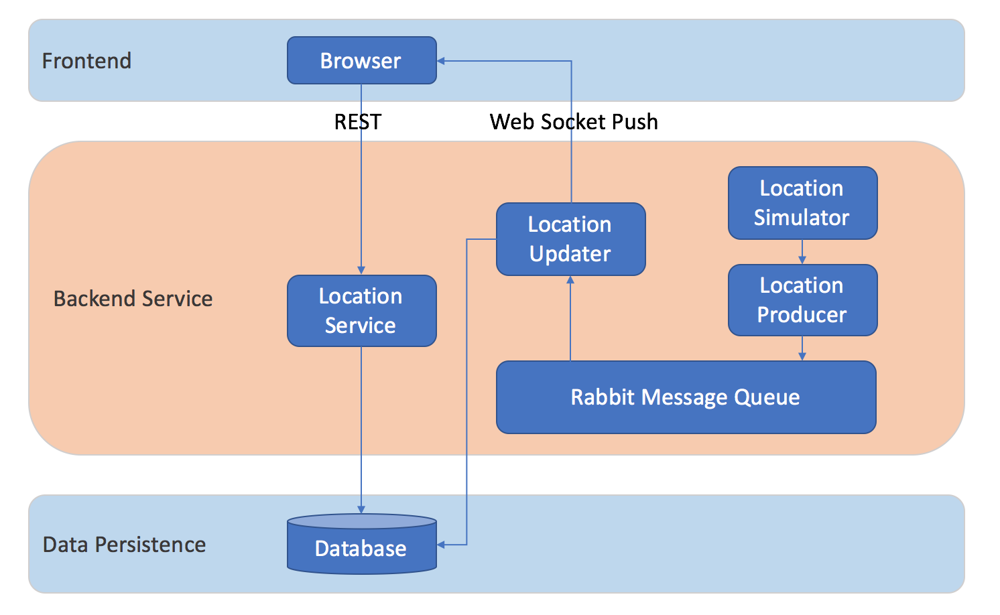

<h1><strong>Real-time Car Location Monitoring System</strong></h1>

This project is a real-time car location simulation and monitoring system using Java, Spring MVC, Spring Boot, Spring Data, Spring Cloud, Maven, JPA, Hibernate, Tomcat, RabbitMQ, MongoDB, WebSocket, HTML, JavaScript, Bootstrap.

**Service Start Steps:**

0. git clone https://github.com/WeiChienHsu/Real_Time_Traffic_Monitor.git
1. cd Real_Time_Traffic_Monitor/week3-4/
2. docker-compose up (Docker has been installed and run)
3. sh ./start-eureka.sh
4. sh ./start-hystrix.sh
5. sh ./start-location-simulator.sh
6. sh ./start-location-ingest.sh
7. sh ./start-location-updater.sh
8. sh ./start-location-service.sh
9. cd ./fleet-location-service 
10. sh ./upload-fleet.sh 
11. cd ..
12. sh ./start-service-location-service.sh
13. cd ./service-location-service
14. sh ./upload-serviceLocations.sh
15. cd ..
16. sh ./start-dashboard.sh

**User Interface**
1. Open Dashboard UI on http://localhost:8080
2. Open Simulator UI on http://localhost:9005
3. Click "Start Simulation" in Simulator and see the changes in Dashboard.
4. Open Eureka UI on http://localhost:8761
5. Open RabbitMQ UI on http://localhost:15672 (Username: guest, Password guest)

**Service Architecture**

***

## Week 1  Learn Spring, Maven & Tomcat 
- Used **Spring** to write *HelloWorld* REST API
- Created **Maven** Project in **IntelliJ**
- Deployed war file in **Tomcat**

## Week 2  Learn Spring Boot, Spring Data, Spring Cloud, RabbitMQ

#### Week 2-1 Learn Spring Boot
- Learned **Spring Boot** to write *HelloWorld* REST API
#### Week 2-2 Fleet Location Service
- Learned **Spring Boot, Spring Data, Spring Cloud** 
- Wrote the *Fleet Location Service* module

