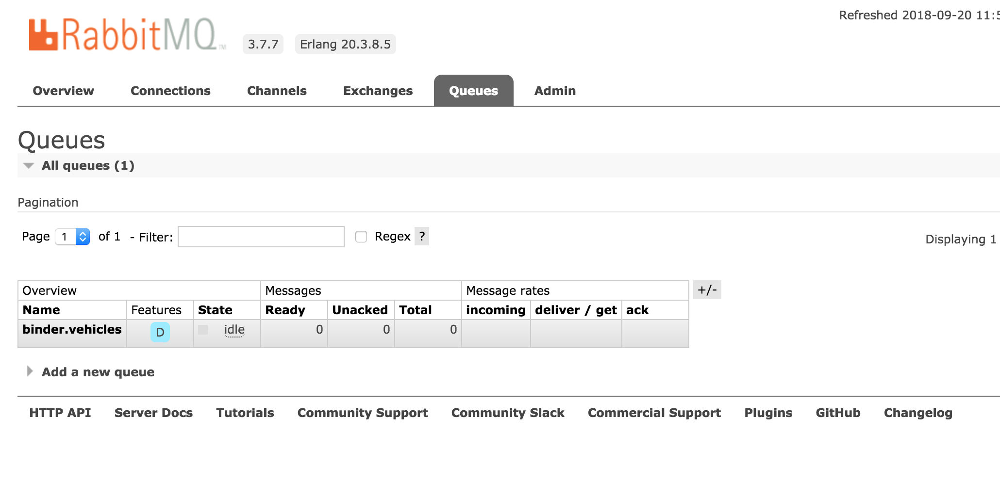

## WorkFlow

Fleet-Location-Simulator 透過調用 restTemplate.postForLocation 得到 fleetLocationIngest + "api/location" 的 URL，而 currentPosition 就是由 GpsSimulator 自動產生的 Location Info。

當這個POST Request生成之後，Fleet-Location-Ingest 內的 RestController 會將接收到的內容 Map 到 /api/locations ，將自己定義為 RabbitMQ 的一個 Soucre，透過 MessageChannel 把 Position Info 發送出去放入 Queue 當中。

接著 Queue 會將 Info 丟入Fleet-Location-Updater，也就是我們標記為 SinkClass 的 FleetLocationUpdaterSink，透過 inputChannel 傳入，並透過objectMapping 轉換成一個 Object CurrentPostiion， 最後透過 convertAndSend deserize 然後發送到 /topic/vechiles，前端就會接收到這些Position Information，前端會根據 Updated Position 來呈現。


## Fleet-Location-Service

### FleetBulkUploadController

Upload the mock lication information into our local database


## Fleet-Location-Simulator (PORT 9005)

### Model

- Define the model of data we need to use.

```java
/**
 * Input JSON file and deserialize to a Point
 */
public class GpsSimulatorRequest {

    private String vin;
    private Double speedInKph;
    private boolean move = true;
    private boolean exportPositionsToKml = false;
    private boolean exportPositionsToMessaging = true;
    private Integer reportInterval = 500;
    private int secondsToError = 0;
    private VehicleStatus vehicleStatus = VehicleStatus.NONE;
    private String polyline;
    private FaultCode faultCode;

    public Double getSpeedInKph() {
        return speedInKph;
    }

    public void setSpeedInKph(Double speedInKph) {
        this.speedInKph = speedInKph;
    }

    public boolean isMove() {
        return move;
    }

/* ..... */

    @Override
    public String toString() {
        return "GpsSimulatorRequest [vin=" + vin + ", speedInKph=" + speedInKph + ", move=" + move + ", exportPositionsToKml="
                + exportPositionsToKml + ", exportPositionsToMessaging=" + exportPositionsToMessaging
                + ", reportInterval=" + reportInterval + "]";
    }

    public void setFaultCode(FaultCode faultCode) {
        this.faultCode = faultCode;
    }

    public FaultCode getFaultCode() {
        return faultCode;
    }

}
```

### LocationSimulatorRESTApi

- Call "SimulatorFixture" in the model to get those data.
- Send to GpsSimulatorFactory to prepare creating the Simulator
- AsyncTaskExecutor: deal with async, after calling this API, we could do another tasks.

```java
/* Inject the Beans that we need to use */
@Autowired
private PathService pathService;

@Autowired
private GpsSimulatorFactory gpsSimulatorFactory;

@Autowired
private AsyncTaskExecutor taskExecutor;
```

### Service

- GpsSimulatorFactor: prepare creating the GpsSimulator

```java
@Service
public class DefaultGpsSimulatorFactory implements GpsSimulatorFactory {

    @Autowired
    private PathService pathService;

    @Autowired
    private PositionService positionService;

    private final AtomicLong instanceCounter = new AtomicLong();

    @Override
    public GpsSimulator prepareGpsSimulator(GpsSimulatorRequest gpsSimulatorRequest) {

        final GpsSimulator gpsSimulator = new GpsSimulator(gpsSimulatorRequest);

        gpsSimulator.setPositionInfoService(positionService);
        gpsSimulator.setId(this.instanceCounter.incrementAndGet());

        final List<Point> points = NavUtils.decodePolyline(gpsSimulatorRequest.getPolyline());
        gpsSimulator.setStartPoint(points.iterator().next());

        return prepareGpsSimulator(gpsSimulator, points);
    }

    @Override
    public GpsSimulator prepareGpsSimulator(GpsSimulator gpsSimulator, File kmlFile) {

        final List<Point> points;

        if (kmlFile == null) {
            points = this.pathService.getCoordinatesFromGoogle(this.pathService.loadDirectionInput().get(0));
        } else {
//            points = this.pathService.getCoordinatesFromKmlFile(kmlFile);
            points = new ArrayList<>();
        }

        return prepareGpsSimulator(gpsSimulator, points);
    }

    @Override
    public GpsSimulator prepareGpsSimulator(GpsSimulator gpsSimulator, List<Point> points) {
        gpsSimulator.setCurrentPosition(null);

        final List<Leg> legs = createLegsList(points);
        gpsSimulator.setLegs(legs);
        gpsSimulator.setStartPosition();
        return gpsSimulator;
    }

    /**
     * Creates list of legs in the path
     *
     * @param points
     */
    private List<Leg> createLegsList(List<Point> points) {
        final List<Leg> legs = new ArrayList<Leg>();
        for (int i = 0; i < (points.size() - 1); i++) {
            Leg leg = new Leg();
            leg.setId(i);
            leg.setStartPosition(points.get(i));
            leg.setEndPosition(points.get(i + 1));
            Double length = NavUtils.getDistance(points.get(i), points.get(i + 1));
            leg.setLength(length);
            Double heading = NavUtils.getBearing(points.get(i), points.get(i + 1));
            leg.setHeading(heading);
            legs.add(leg);
        }
        return legs;
    }
}
```

### Task

- GpsSimulator and GpsSimulatorInstance to store the data we get. 

```java
public class GpsSimulatorInstance {

    private long instanceId;
    private GpsSimulator gpsSimulator;
    private Future<?> gpsSimulatorTask;

    public GpsSimulatorInstance(long instanceId, GpsSimulator gpsSimulator, Future<?> gpsSimulatorTask) {
        super();
        this.instanceId = instanceId;
        this.gpsSimulator = gpsSimulator;
        this.gpsSimulatorTask = gpsSimulatorTask;
    }

    public long getInstanceId() {
        return instanceId;
    }

    public void setInstanceId(long instanceId) {
        this.instanceId = instanceId;
    }

    public GpsSimulator getGpsSimulator() {
        return gpsSimulator;
    }

    public void setGpsSimulator(GpsSimulator gpsSimulator) {
        this.gpsSimulator = gpsSimulator;
    }

    public Future<?> getGpsSimulatorTask() {
        return gpsSimulatorTask;
    }

    public void setGpsSimulatorTask(Future<?> gpsSimulatorTask) {
        this.gpsSimulatorTask = gpsSimulatorTask;
    }

    @Override
    public String toString() {
        return "GpsSimulatorInstance [instanceId=" + instanceId + ", gpsSimulator=" + gpsSimulator
                + ", gpsSimulatorTask=" + gpsSimulatorTask + "]";
    }

}
```


## Fleet-Location-Ingest (PORT 9006)



把一個REST call 轉變到 RabbitMQ內，成為RabbitMQ的Source。

- Active as a sender to connect with Simulator and put the position Info into the RabbitMQ.
- Binding the sources and inject MessageChannel created by springframework.cloud.
- Send the String of position information built by MessageBuilder.

```java
import org.springframework.cloud.stream.messaging.Source;

@EnableBinding(Source.class)
@RestController
public class VehiclePositionsSource {

    @Autowired
    private MessageChannel output;

    @RequestMapping(path = "/api/locations", method = RequestMethod.POST)
    public void locations(@RequestBody String positionInfo) {
        this.output.send(MessageBuilder.withPayload(positionInfo).build());
    }

}
```

- Configue the port and channel.

```yml
server:
  port: 9006
spring:
  application:
    name: fleet-location-ingest
  cloud:
    stream:
      bindings:
        output: vehicles
```

## Fleet-Location-Updater

- Using WebSocket to update the latest location information in the frontend.
- FleetLocationUpdaterSink receive the message from MessageMQ
- Used objectMapper mapping the String into Object CurrentPosition.

```java
@MessageEndpoint
@EnableBinding(Sink.class)
public class FleetLocationUpdaterSink {

    @Autowired
    private SimpMessagingTemplate template;

    @Autowired
    private ObjectMapper objectMapper;

    @ServiceActivator(inputChannel = Sink.INPUT)
    public void updateLocationaddServiceLocations(String input) throws Exception {

        CurrentPosition payload = this.objectMapper.readValue(input, CurrentPosition.class);
        /* Same path to the js request to the data */
        this.template.convertAndSend("/topic/vehicles", payload);
    }
}
```

***

## Dashboard

### Zuul

- Handle the cross domain : All Requests from frontend to /fleet-location-service/** will be transfered to http://localhost:9000.

```java
@SpringBootApplication
@EnableZuulProxy
public class DashboardApplication {

    public static void main(String[] args) {
        SpringApplication.run(DashboardApplication.class, args);
    }

}
```

```xml
spring:
  application:
    name: dashboard
stomp:
  url: localhost:9007/stomp

zuul:
  routes:
    fleet-location-service:
      path: /fleet-location-service/**
      url: http://localhost:9000
    service-location-service:
      path: /service-location-service/**
      url: http://localhost:9001
```

### Dashboard

基礎服務，無關乎業務處理。

- Eureka
- hystrix

### Eureka - Services Registration / Discovery

- When there is a new micro service was added, (Without a service manager which means the same data center), in a cross domain situation. Requests enter and call for the service, eureka where do the sync up with other services and update this new request to call.


```java
package eurekademo;

import org.springframework.boot.SpringApplication;
import org.springframework.boot.autoconfigure.SpringBootApplication;
import org.springframework.cloud.netflix.eureka.server.EnableEurekaServer;


@SpringBootApplication
@EnableEurekaServer
public class EurekaApplication {

    public static void main(String[] args) throws Exception {
        SpringApplication.run(EurekaApplication.class, args);
    }

}
```

```yml
server:
  port: 8761

eureka:
  client:
    registerWithEureka: false
    fetchRegistry: false
  server:
    waitTimeInMsWhenSyncEmpty: 0

---
spring:
  profiles: cloud

eureka:
  client:
    registerWithEureka: true
    fetchRegistry: true
---

spring:
  application:
    name: eureka
  cloud:
    config:
      uri: ${CONFIG_SERVER_URI:${vcap.services.${PREFIX:}configserver.credentials.uri:http://localhost:8888}}
```


### hystrix

Hystrix is a latency and fault tolerance library designed to isolate points of access to remote systems, services and 3rd party libraries, stop cascading failure and enable resilience in complex distributed systems where failure is inevitable.

***

## Slf4j 

Simple Logging Facade for Java provides a Java logging API by means of a simple facade pattern


```java
@Service
@Slf4j
public class DefaultPositionService implements PositionService {

    private static final Logger LOGGER = LoggerFactory.getLogger(DefaultPositionService.class);

    @Autowired
    private RestTemplate restTemplate;

    public DefaultPositionService() {
        super();
    }

    @HystrixCommand(fallbackMethod = "processPositionInfoFallback")
    @Override
    public void processPositionInfo(long id, CurrentPosition currentPosition, boolean exportPositionsToKml,
                                    boolean sendPositionsToIngestionService) {

        String fleetLocationIngest = "http://fleet-location-ingest";
        if (sendPositionsToIngestionService) {
            log.info("Simulator is callling ingest REST API");
            this.restTemplate.postForLocation(fleetLocationIngest + "/api/locations", currentPosition);
        }

    }

    public void processPositionInfoFallback(long id, CurrentPosition currentPosition, boolean exportPositionsToKml,
                                            boolean sendPositionsToIngestionService) {
        LOGGER.error("Hystrix Fallback Method. Unable to send message for ingestion.");
    }

}
```